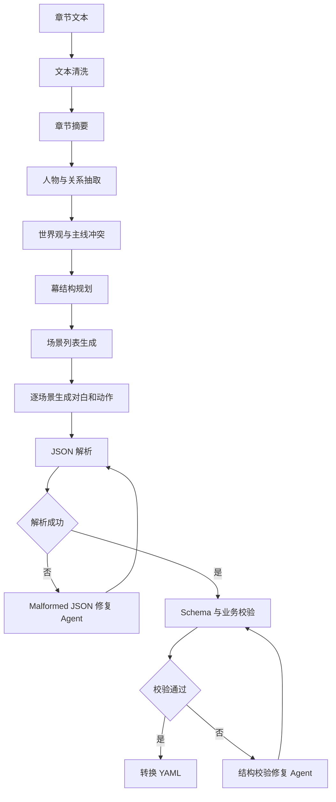

# AI 生成流水线设计

## 1. 目标

AI 不是直接替作者写终稿，而是把小说原文转换成一份结构清晰、能被继续编辑的剧本初稿。流水线必须兼顾稳定性、可追溯性和可修复性。

## 2. 输入要求

- 至少 3 个章节。
- 支持粘贴文本和上传 `.txt` 文件。
- 后端统一做编码、换行、空白字符清洗。
- 每个章节保留 `chapter_index`、`title`、`content`、`word_count`。

## 3. 分阶段流程



## 4. 为什么不一次生成完整 YAML

长篇小说改编很容易遇到上下文过长、结构漂移、角色名字不一致、YAML 缩进错误等问题。分阶段生成可以把错误控制在更小范围：

- 章节摘要错了，只重跑摘要。
- 人物表错了，只重跑人物抽取。
- 某一场景不合格，只重跑该场景。

## 5. 中间数据契约

AI 中间输出采用 JSON：

- `chapter_summaries`
- `characters`
- `story_outline`
- `scene_plan`
- `scene_drafts`

后端把这些结构合并成 `ScriptDraft`，校验通过后再导出 YAML。模型响应如果出现截断 JSON、Markdown 包裹、字段缺失或引用错误，会进入 agent 修复步骤，而不是直接把坏结果交给前端。

## 6. Prompt 结构

每个阶段的提示词都包含四部分：

- 任务目标：说明当前阶段只做什么。
- 输入边界：给出章节、摘要或上一阶段结果。
- 输出结构：要求返回 JSON 对象。
- 质量约束：要求保留章节引用、避免新增无法追溯的关键情节。

示例骨架：

```text
你是小说改编剧本助理。
请根据输入章节生成场景计划。
只输出 JSON，不要输出解释。
每个场景必须包含 chapter_refs、purpose、conflict、characters。
不要凭空新增核心人物；如果必须推断，请写入 ai_assumptions。
```

## 7. 模型接入

当前实现通过后端真实调用 OpenAI-compatible 模型 provider。设计约束如下：

- 模型配置只能放在后端环境变量或配置文件中，前端不接触 Key。
- 模型名称不写死在前端。
- 对关键阶段使用结构化输出约束，降低解析失败概率。
- 所有模型调用通过 `internal/ai` 包封装，便于替换 provider。

必需配置项：

```text
MODEL_PROVIDER=
MODEL_BASE_URL=
MODEL_API_KEY=
MODEL_NAME=
MODEL_TIMEOUT_SECONDS=120
MODEL_MAX_RETRIES=2
```

## 8. 校验与修复

校验分两层：

- Schema 校验：字段、类型、必填项。
- 业务校验：章节引用、角色引用、场景归属、ID 唯一性。

修复策略：

1. 能由程序补齐的字段直接补齐，例如空数组。
2. JSON 解析失败时进入 Malformed JSON 修复 Agent，结合原始输出和输入上下文补齐完整 `ScriptDraft`。
3. 引用错误、结构缺失交给结构校验修复 Agent。
4. 修复超过次数后标记任务失败，并把错误展示给前端，同时后端日志保留 LLM 步骤、状态码和响应摘要。

## 9. 真实生成流程

比赛 demo 使用真实模型生成。为了让结果可校验，后端采用以下策略：

- 使用 `chat/completions` 请求结构化 JSON。
- 使用 `response_format` 约束输出格式，默认优先使用 JSON Schema。
- `internal/ai` 中的 `ScriptAgent` 负责生成、局部重写、Malformed JSON 修复和结构校验修复。
- 如果完整剧本生成触发 `finish_reason=length`，Agent 会自动切换到分解式流程：先生成剧本计划，再逐场调用 scene agent 生成对白和动作，最后组装完整 `ScriptDraft`。
- 模型输出先解析成 `ScriptDraft`，通过业务校验后再导出 YAML。
- `backend/testdata/` 仅用于提供可重复导入的小说样例，不替代模型调用。

如果模型配置缺失、网络失败或输出不符合引用规则，任务会进入 failed 状态并把错误展示给前端。

## 10. 可解释性设计

输出的每个场景都保留：

- `chapter_refs`
- `purpose`
- `conflict`
- `ai_assumptions`

作者可以看到 AI 为什么这样改，而不是只拿到一段不可解释的文本。

