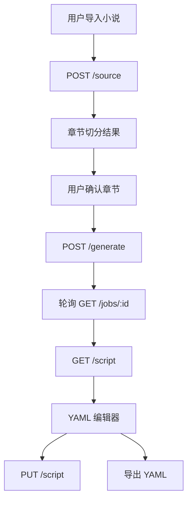

# 前端架构设计

## 1. 前端定位

前端不是一个展示页，而是一个面向小说作者的改编工作台。核心价值是让作者能看懂 AI 的改编思路、快速修改结构化剧本，并把结果导出为 YAML。

## 2. 技术栈

- React：构建页面和组件。
- Vite：提供快速开发和构建。
- TypeScript：约束 API 数据结构和编辑器状态。
- TanStack Query：管理项目、任务、剧本版本等服务端状态。
- Zustand：管理当前选中的章节、场景、面板和本地草稿。
- Monaco Editor：承载 YAML 编辑体验。
- React Router：管理工作台路由。

## 3. 页面结构

```text
/
  项目列表
/projects/new
  新建项目与小说导入
/projects/:projectId/source
  章节切分确认
/projects/:projectId/generate
  生成配置与任务进度
/projects/:projectId/editor
  剧本编辑、预览、导出
/projects/:projectId/versions
  历史版本对比
```

## 4. 工作台布局

编辑页采用三栏布局：

- 左侧：项目章节、幕结构、场景列表。
- 中间：YAML 编辑器与剧本预览切换。
- 右侧：场景详情、来源章节、角色关系、重写控制。

这个布局能让作者同时看到“原文来源、结构化剧本、局部编辑工具”，减少来回跳转。

## 5. 核心组件

| 组件 | 职责 |
| --- | --- |
| `NovelUploader` | 粘贴文本、上传 `.txt` 文件、展示字数 |
| `ChapterSplitter` | 展示后端识别的章节，支持手动合并和拆分 |
| `GenerateConfigForm` | 设置改编目标、集数、风格、对白密度 |
| `JobProgress` | 展示 AI 任务阶段、耗时、错误 |
| `ScriptOutline` | 按幕和场景浏览生成结果 |
| `YamlEditor` | 编辑 YAML，并显示 Schema 校验提示 |
| `SceneInspector` | 展示场景来源、人物、冲突、节拍 |
| `RegeneratePanel` | 对单场景、对白或梗概做局部重写 |
| `ExportToolbar` | 导出 YAML、复制内容、下载版本 |

## 6. 状态设计

### 6.1 服务端状态

通过 TanStack Query 管理：

- `projects`
- `chapters`
- `jobs`
- `currentScript`
- `scriptVersions`

所有会影响数据库的操作都走 mutation，例如保存 YAML、发起生成、局部重写。

### 6.2 本地状态

通过 Zustand 管理：

- 当前选中章节。
- 当前选中场景。
- 编辑器是否有未保存改动。
- 当前展示模式：`yaml`、`preview`、`split`。
- 右侧面板状态：`source`、`character`、`regenerate`。

## 7. 前端数据流



## 8. 校验与错误提示

- 前端在保存前先做 YAML 解析。
- 解析成功后调用后端 Schema 校验接口。
- 校验错误按路径展示，例如 `scenes[2].characters[0]`。
- AI 生成失败时展示阶段信息，例如“角色抽取失败”或“场景生成超时”。

## 9. 演示友好设计

- 内置一份示例小说，保证 demo 视频不依赖现场复制长文本。
- 提供 mock 生成模式，避免演示时 OpenAI Key 或网络出问题。
- 生成进度按阶段展示，让评委能清楚看到工具不是单纯文本框。

## 10. 测试重点

- 上传和粘贴两种导入方式。
- 章节确认后的状态保存。
- 生成任务轮询和失败提示。
- YAML 编辑器保存、恢复、导出。
- 移动端只保证可查看和轻量编辑，桌面端是主要体验。

